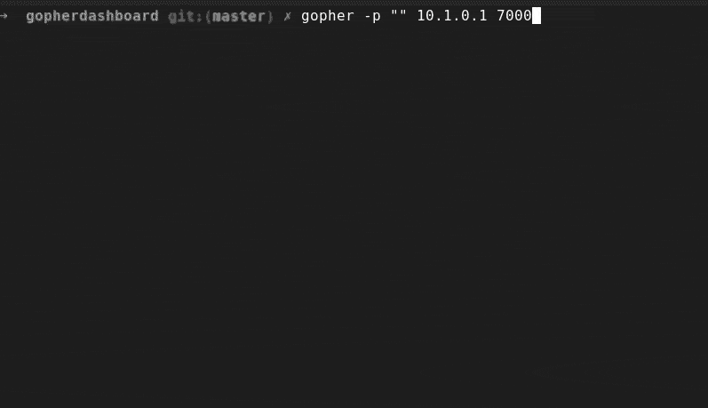

# gopherdashboard

Gopher Protocol sysadmin dashboard for executing commands and viewing logs/outputs.

Visiting the dashboard using the `gopher` client or [the Gopher Protocol client I made: Waffle](https://github.com/someodd/waffle).

## Preview running in `gopher`



Here's an example I copied from `gopher` visiting the gopherhole (using `gopher -p "" 10.1.0.1 7000`):

```
           ### Dashboard Commands ###
           Document Approximately Created At: 2023-12-27 08:26:44
 -->  [3]  Regenerate Dashboard/
      [4]  Service Status <?>
      [5]  Disk Usage

           ### debsecan - the Debian Security Analyzer (..bsecan/report.log) ###
      [8]  View full /var/log/debsecan/report.log
           Last Modified: 2023-12-27 04:16:23
           > CVEs found: 1301
           >

           ### chkrootkit - locally checks for signs of a rootkit (..it.log) ###
      [14] View full /var/log/chkrootkit.log
           Last Modified: 2023-12-27 04:29:58
           > Searching for suspicious files and dirs...                  WARNI..
           > WARNING: The following suspicious files and directories were foun..
           > Searching for Linux.Xor.DDoS...                             WARNI..
           > WARNING: Possible Linux.Xor.DDoS installed:
           > Checking `sniffer'...
```

## Features

Here are some things you can do with a JSON config file (see an example in `etc/gopherdashboard.json`):

* Define files to "preview" and link to and how the file is previewed (like `cat %s | grep 'errors'` or `tail %s`)
* Execute commands, including commands that get input from a Gopher Protocol query
* Server included (thanks Spacecookie!) and packaged

## Security

If enabled, this software makes it so you can basically execute arbitrary commands on a
computer using the Gopher Protocol. The packaged daemon is set up to run as root by
default, which is obviously a security risk. I advise that you restrict how it can be
accessed.

In the config the important security options are:

- `serverSwitchUser`: If this option is not defined the daemon will run as `root`, which
  is a security risk, but it also allows for execution of administrative tasks through the
  gopher protocol.
- `serverAllowQuery`
- `serverForceRoot` and `serverRoot`
- `serverHost` and `serverPort`: I recommend you restrict this and also NOT listening on
  port 70. For example, only listening on the server's WireGuard VPN IP. I also have my
  firewall enforce this as well: 
  ```
  sudo ufw allow from 10.1.0.0/24 to any port 7000 proto tcp comment 'gopherdashboard'
  ```

### Using `serverSwitchUser`

Please use `gopherdashboard` as the user for now. If you select this you may want to
symlink and permissions the symlinks to various logs on your system in
`/var/gopherdashboard`...

What about commands?

## Installing

* Install the `.deb` package (release): I recommend this because I've made it into a daemon/service
* Build using the [Nix package system](https://nixos.wiki/wiki/Nix_package_manager)
* Build using Cabal

### From `.deb` package

You should be able to find a `.deb` package in one of the releases.

```
sudo apt-get install -y ./gopherdashboard-amd64.deb
```

Then edit your `/etc/gopherdashboard.json` and finally:

```
sudo service gopherdashboard restart
```

Now you should be able to view the dashboard with a Gopher client like this:

```
gopher -p "" 10.1.0.1 7000
```

## Very alpha

Sorry this is very sloppy, but I wanted to get it out-the-door. I'll probably clean it up
in the future.

I whipped this up quick because I wanted to have a simple way to keep tabs on security
reports (and other stuff) on my server, or the like.

## Using the CLI

### Generate dashboard

Generate the dashboard (in the demo `config.json`I configured a menu command that allows
you to regenerate the dashboard through gopher):

```
nix run .#gopherdashboard -- generate etc/gopherdashboard.testing.json > dashboard
```

If you really want you can use `cabal`:

```
cabal run gopherdashboard-exe -- generate etc/gopherdashboard.testing.json > dashboard
```

Or you can use the binary:

```
gopherdashboard generate etc/gopherdashboard.testing.json > dashboard
```

### Launch the server

```
gopherdashboard serve etc/gopherdashboard.json
```

I recommend using the daemon I configured (`.deb` package release).

## Troubleshooting the Service

Try using this:

```
sudo journalctl -u gopherdashboard.service
```

## Special thanks

Special thanks to [spacecookie](https://hackage.haskell.org/package/spacecookie).
